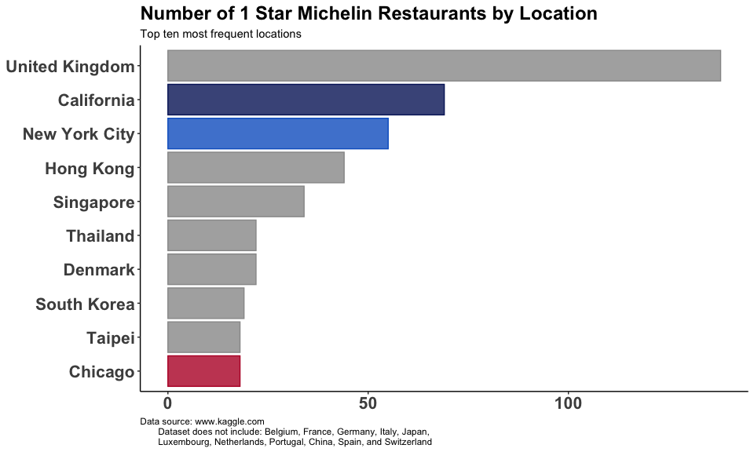
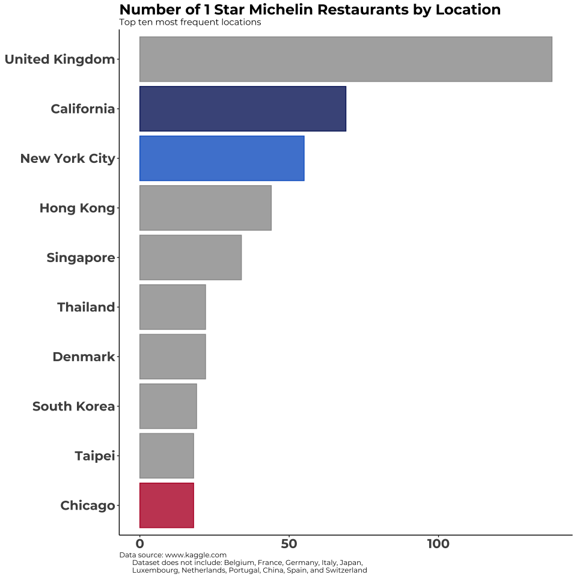

Please find the following R code that demonstrates how to specify different fonts. In this code, [ggplot](https://ggplot2.tidyverse.org/index.html) is used to create a horizontal bar chart.

Here is a link for [R ggthemes](https://ggplot2.tidyverse.org/reference/ggtheme.html).

I’m a fan of the theme_classic, but we can use any. Here is another link for [R themes](https://yutannihilation.github.io/allYourFigureAreBelongToUs/ggthemes/).

In order to change fonts, you will need to use the showtext library. This is a good [link](https://github.com/yixuan/showtext) to read more about it.


Here is another [link](https://www.r-bloggers.com/adding-custom-fonts-to-ggplot-in-r/) to learn more about custom fonts.


Pick your font [here](https://fonts.google.com/).

```R
#this code uses the default font
ggplot(ten_region, aes(x=reorder(region, freq), y=freq)) +
  geom_bar(stat='identity', fill = bar_palette, color = bar_palette, alpha = 0.8) +
  labs(title="Number of 1 Star Michelin Restaurants by Location",
       subtitle="Top ten most frequent locations",
       caption = "Data source: www.kaggle.com
       Dataset does not include: Belgium, France, Germany, Italy, Japan,
       Luxembourg, Netherlands, Portugal, China, Spain, and Switzerland ") +
  coord_flip() +
  theme_classic() +
  theme(
    plot.title = element_text(face="bold", size=18),
    plot.caption = element_text(hjust = 0),
    axis.title.x = element_blank(),
    axis.title.y = element_blank(),
    axis.text.x = element_text(face="bold", size=16),
    axis.text.y = element_text(face="bold", size=16),
    legend.text = element_text(face="bold", size=12),
    legend.title = element_blank(),
    legend.position="bottom", legend.box = "horizontal")
ggsave("showtext-example-1.png", width = 10, height = 6, dpi=96)

```


This is the same code modified using the showtext library. The montserrat font is used.

```R
#############Same chart with custom font Montserrat############
#read these links to learn more about showtext
#https://github.com/yixuan/showtext
#https://www.r-bloggers.com/adding-custom-fonts-to-ggplot-in-r/

# install and load needed packages
install.packages("showtext")
library(showtext)

# Find the font you want at: https://fonts.google.com/
font_add_google(name="Montserrat", family="montserrat")

#From the https://github.com/yixuan/showtext site:
#Known Issues
#showtext does not work well with the RStudio graphics device (RStudioGD). 
#Therefore, if you want to display graphs on a window device in RStudio, 
#you need to manually open one, e.g., x11() on Linux, windows() on Windows, and quartz() on Mac OS.

#But if you save to png, then you don't need to run quartz() or windows()


#you can optimize the png height, width, and resolution as you see fit
#the png settings below are for demo purposes
png("show2.png", 960, 960, res=96)
# turn on showtext
showtext_begin()
ggplot(ten_region, aes(x=reorder(region, freq), y=freq)) +
  geom_bar(stat='identity', fill = bar_palette, color = bar_palette, alpha = 0.8) +
  labs(title="Number of 1 Star Michelin Restaurants by Location",
       subtitle="Top ten most frequent locations",
       caption = "Data source: www.kaggle.com
       Dataset does not include: Belgium, France, Germany, Italy, Japan,
       Luxembourg, Netherlands, Portugal, China, Spain, and Switzerland ") +
  coord_flip() +
  theme_classic() +
  theme(
    plot.title = element_text(family="montserrat", face="bold", size=18),
    plot.subtitle = element_text(family="montserrat"),
    plot.caption = element_text(family="montserrat", hjust = 0),
    axis.title.x = element_blank(),
    axis.title.y = element_blank(),
    axis.text.x = element_text(family="montserrat", face="bold", size=16),
    axis.text.y = element_text(family="montserrat", face="bold", size=16),
    legend.text = element_text(family="montserrat", face="bold", size=12),
    legend.title = element_blank(),
    legend.position="bottom", legend.box = "horizontal")
#turn off showtext
showtext_end()
dev.off()
```


The R script and csv file are included in this folder if you'd like to run and test on your machine.


